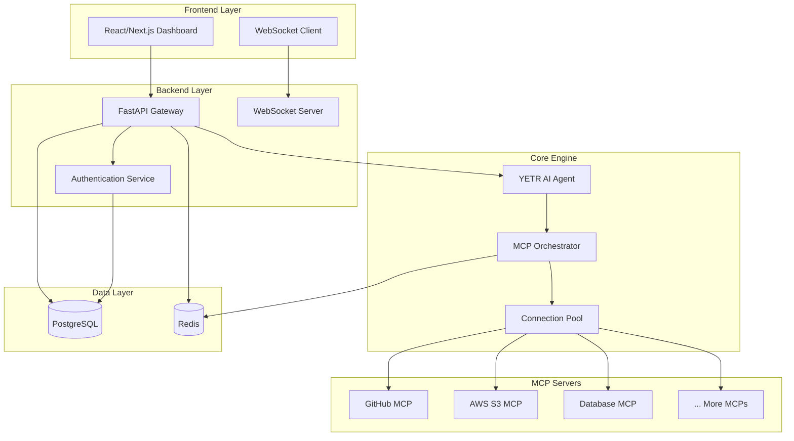

# 🤖 YETR - Your Enhanced Task Runner

<div align="center">

[](https://opensource.org/licenses/MIT)
[](https://www.python.org/downloads/)
[](https://www.typescriptlang.org/)
[](https://fastapi.tiangolo.com/)
[](https://nextjs.org/)

**A powerful AI agent system that connects to multiple MCP servers simultaneously, providing unified access to diverse tools and data sources through a modern web interface.**

[🚀 Quick Start](#-quick-start) • [📖 Documentation](#-documentation) • [🏗️ Architecture](#️-architecture) • [🔧 Development](#-development) • [🐳 Deployment](#-deployment)

</div>

## ✨ Features

### 🎯 Core Capabilities
- **Multi-MCP Integration**: Connect to multiple Model Context Protocol servers simultaneously
- **Intelligent Tool Discovery**: Automatically discover and catalog available tools across all connected servers
- **Natural Language Interface**: Chat with YETR using natural language to execute complex tasks
- **Real-time Monitoring**: Live status updates and health monitoring for all MCP server connections
- **Unified Dashboard**: Manage all your MCP servers from a single, intuitive web interface

### 🛠️ Technical Highlights
- **Modern Stack**: FastAPI backend with Next.js frontend
- **Type Safety**: Full TypeScript implementation for frontend and API contracts
- **Scalable Architecture**: Microservices-ready with Docker and Kubernetes support
- **Security First**: OAuth 2.1 authentication with JWT tokens and comprehensive security measures
- **Production Ready**: Complete CI/CD pipeline, monitoring, and deployment configurations

## 🚀 Quick Start

### Prerequisites
- **Docker & Docker Compose** (recommended for quick setup)
- **Python 3.11+** and **Node.js 18+** (for local development)
- **PostgreSQL 15+** and **Redis 7+** (if running without Docker)

### 🐳 Docker Setup (Recommended)

1. **Clone the repository**
   ```bash
   git clone https://github.com/your-org/yetr-ai-agent.git
   cd yetr-ai-agent
   ```

2. **Configure environment**
   ```bash
   cp .env.example .env
   # Edit .env with your configuration
   ```

3. **Start all services**
   ```bash
   docker-compose up -d
   ```

4. **Open your browser**
   - Frontend: http://localhost:3000
   - API Documentation: http://localhost:8000/docs
   - Monitoring Dashboard: http://localhost:3001

### 🔧 Local Development Setup

<details>
<summary>Click to expand local development instructions</summary>

1. **Backend Setup**
   ```bash
   cd backend
   python -m venv venv
   source venv/bin/activate  # On Windows: venv\Scripts\activate
   pip install -r requirements.txt
   ```

2. **Frontend Setup**
   ```bash
   cd frontend
   npm install
   ```

3. **Database Setup**
   ```bash
   # Start PostgreSQL and Redis
   docker-compose up postgres redis -d
   
   # Run migrations
   cd backend
   alembic upgrade head
   ```

4. **Start Development Servers**
   ```bash
   # Terminal 1: Backend
   cd backend
   uvicorn app.main:app --reload --port 8000
   
   # Terminal 2: Frontend
   cd frontend
   npm run dev
   ```

</details>

## 🏗️ Architecture

YETR follows a modern microservices architecture designed for scalability and maintainability:



### Key Components

- **Frontend**: Next.js 14 with TypeScript and Tailwind CSS
- **Backend**: FastAPI with Python 3.11+ and official MCP SDK
- **Database**: PostgreSQL for persistent data, Redis for caching and sessions
- **MCP Integration**: Connection pool manager with health monitoring
- **Security**: OAuth 2.1/PKCE authentication with JWT tokens

## 📖 Documentation

### 📚 User Guides
- [Getting Started Guide](docs/user-guide/getting-started.md)
- [MCP Server Configuration](docs/user-guide/mcp-configuration.md)
- [Using the YETR AI Agent](docs/user-guide/yetr-usage.md)
- [Dashboard Overview](docs/user-guide/dashboard.md)

### 🔧 Developer Documentation
- [API Reference](docs/api/README.md)
- [MCP Integration Guide](docs/development/mcp-integration.md)
- [Contributing Guidelines](CONTRIBUTING.md)
- [Code Style Guide](docs/development/code-style.md)

### 🚀 Deployment Guides
- [Docker Deployment](docs/deployment/docker.md)
- [Kubernetes Deployment](docs/deployment/kubernetes.md)
- [Production Setup](docs/deployment/production.md)
- [Monitoring & Observability](docs/deployment/monitoring.md)

## 🔧 Development

### 🧪 Testing

```bash
# Backend tests
cd backend
pytest tests/ -v

# Frontend tests
cd frontend
npm test

# End-to-end tests
npm run test:e2e
```

### 🔍 Code Quality

```bash
# Linting and formatting
cd backend
black . && isort . && flake8

cd frontend
npm run lint && npm run format
```

### 🐛 Debugging

- **Backend**: FastAPI development server provides detailed error pages
- **Frontend**: React DevTools and Next.js debugging capabilities
- **Database**: PgAdmin available at http://localhost:5050 (development only)
- **Logs**: Structured logging with configurable levels

## 🐳 Deployment

### Development Environment
```bash
docker-compose up -d
```

### Production Environment
```bash
# Using production compose file
docker-compose -f docker-compose.prod.yml up -d

# Or deploy to Kubernetes
kubectl apply -k k8s/overlays/production
```

### Environment Configuration

| Variable | Description | Default |
|----------|-------------|---------|
| `DATABASE_URL` | PostgreSQL connection string | `postgresql://...` |
| `REDIS_URL` | Redis connection string | `redis://localhost:6379` |
| `JWT_SECRET_KEY` | JWT signing secret | (generated) |
| `FRONTEND_URL` | Frontend application URL | `http://localhost:3000` |
| `MCP_SERVERS_CONFIG` | MCP servers configuration file | `config/mcp-servers.json` |

## 🤝 Contributing

We welcome contributions! Please see our [Contributing Guidelines](CONTRIBUTING.md) for details.

### 🐛 Reporting Issues
- Use the [issue template](.github/ISSUE_TEMPLATE.md)
- Include reproduction steps and environment details
- Check existing issues before creating new ones

### 💡 Feature Requests
- Use the [feature request template](.github/FEATURE_REQUEST_TEMPLATE.md)
- Describe the use case and expected behavior
- Consider contributing the implementation

## 📄 License

This project is licensed under the MIT License - see the [LICENSE](LICENSE) file for details.

## 🙏 Acknowledgments

- [Anthropic](https://anthropic.com) for developing the Model Context Protocol
- [FastAPI](https://fastapi.tiangolo.com/) for the excellent Python web framework
- [Next.js](https://nextjs.org/) for the powerful React framework
- All MCP server developers contributing to the ecosystem

## 📞 Support

- **Documentation**: [docs.yetr.ai](https://docs.yetr.ai)
- **Community**: [Discord Server](https://discord.gg/yetr)
- **Issues**: [GitHub Issues](https://github.com/your-org/yetr-ai-agent/issues)
- **Email**: support@yetr.ai

---

<div align="center">
Made with ❤️ by the YETR Team
</div>
